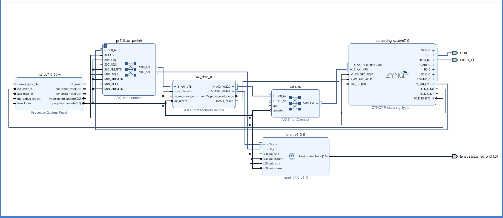
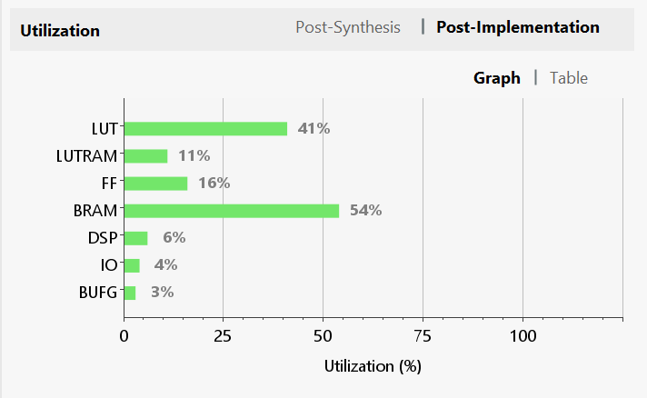
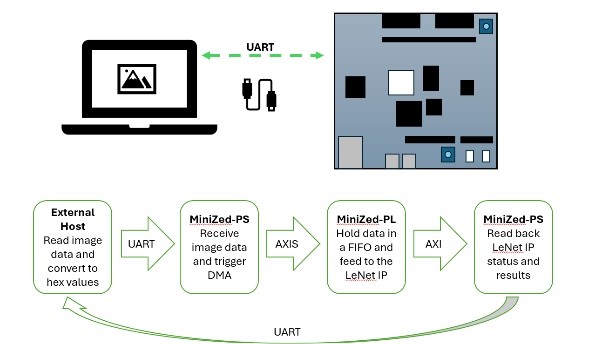

# ASPLOC (QLeNet)

This project was carried out as a part of **Accelerating Systems with Programmable Logic Components(1DT109)** in Uppsala University. 

### Overview

This repository has two main part. The first part will train the LeNet model and checks the quantization errors after quantizing weights and biases. The second part is to implement the python code on FPGA using Verilog. 

### LeNet quantization on Software.

The src/lenet_quantize.ipynb uses an existing well tuned LeNet architecture. First the model is trained and accuracy is checked using PyTorch. The model returned after this had 98.88% accuracy. Then the 2d convolution, dense connections, relu, and maxpool functions are decomposed to run on single thread. 

The weights are biases then converted to scaled up quantized values by using fs256_quantize function. The reason to use scaling value 256 is because it was identified while using absmax_quantize function that the scaling factor  is in the range of 200. This will also help later when dequantizing the values on FPGA.

The quantized weights and biases were used along with fs256_quantize and fs256_dequantize included between model layers. This modification caused the accuracy to drop to 96.08 %. The reduction in accuracy is caused by the quantization error. However, after adding input quantization with fs4_quantize function, the accuracy went back to 98.01 %.

The quantized weights and biases are saved to data/np_data folder. Also the save weights are writen into .mem files to be used in Verilog code. 

### LeNet model on FPGA

The relevant files including the Vivado project can be found in asploc_cnn folder. The implementation has two main sub-parts, conv2d and dense, which performs the 2d convolution and the dense connections. These two parts can also use individually if needed (This need a new NN architecture and re-train of the model) but here we are connecting them as similar to the software implementation. The top module is then wrapped with AXI general and streaming slave interfaces to work as a peripheral. 

This top module, lenet_v1_0_0, is connected as shown in below figure. 

This design is targeted and tested for [MiniZed](https://minized.org/) board. After running the Synthesis and Implementation, the resource utilization was as follow. 

The communication flow is shown in below diagram. 

### QLeNet Driver

The driver files for LeNet IP can be found in asploc_cnn/asploc_cnn.sdk/qlenet. Once the bitstream is generated and export to the Vivado SDK, create an empty project and add the source files to the src directory and compile. This driver was designed and tested using Vivado 2018.3 SDK tool kit. 

### Results

The LeNet IP returns 84.33% accuracy when evaluated over 10000 images. It takes around 20min to run all 10000 predictions with the communication flow mentioned above. The LeNet IP is idle most of the time which can be seen by the active PL-LED connected to the IP and most of the time is consumed by the UART connection to receive data. 

### Future works

* Verification is not complete. Need a formalized test setup to verify. Use UVM.
* Send image data bulk and improve the utilization of the LeNet IP.