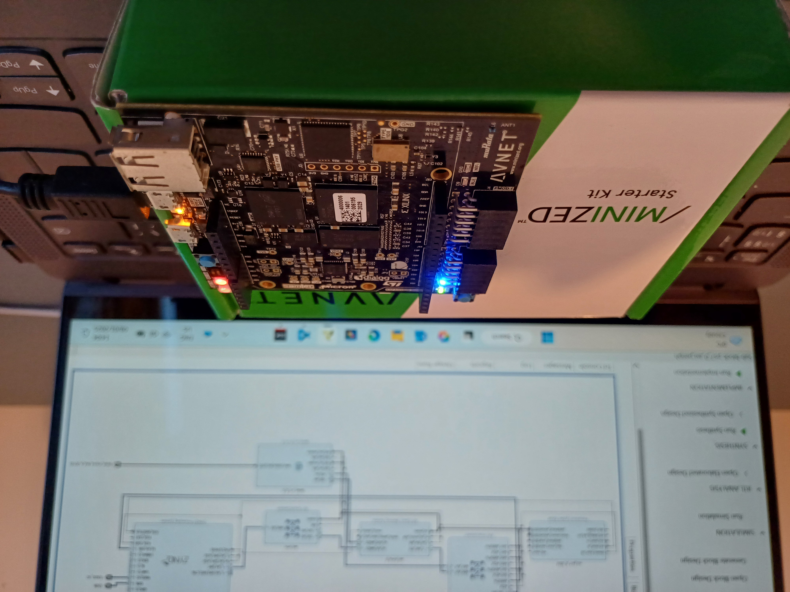
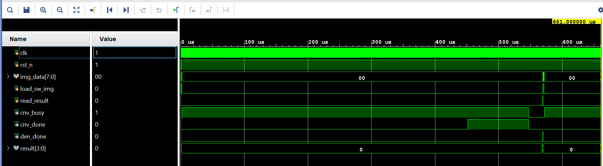

# ASPLOC (QLeNet)

This project was carried out as a part of **Accelerating Systems with Programmable Logic Components(1DT109)** in Uppsala University. 

### Overview

This repository has two main parts. The first part will train the LeNet model and check the quantization errors after quantizing weights and biases. The second part is to implement the Python code on FPGA using Verilog. 

### LeNet quantization on Software.

The src/lenet_quantize.ipynb uses an existing well-tuned LeNet architecture. First, the model is trained, and accuracy is checked using PyTorch. The model returned after this had 98.88% accuracy. Then, the 2D convolution, dense connections, relu, and max pool functions are decomposed to run on a single thread. 

The weights and biases were then converted to scaled-up quantized values by using the fs256_quantize function. The scaling value 256 was chosen because the scaling factors were identified while using the absmax_quantize function, which is in the range of 200. This will also help later when de-quantizing the values on the FPGA.

The quantized weights and biases were used along with fs256_quantize and fs256_dequantize included between model layers. This modification caused the accuracy to drop to 96.08 %. The reduction in the accuracy is caused by the quantization error. However, after adding input quantization with the fs4_quantize function, the accuracy went back to 98.01 %.

The quantized weights and biases are saved to data/np_data folder. Also, the weights and biases are written into .mem files to be used in Verilog code. 

### LeNet model on FPGA

The relevant files including the Vivado project can be found in the asploc_cnn folder. The implementation has two main sub-parts, **conv2d** and **dense**, which perform the 2d convolution and the dense connections. These two parts can also be used individually if needed (This needs a new NN architecture and re-train of the model) but here we are connecting them according to the LeNet architecture. The top module is then wrapped with AXI general and streaming slave interfaces to work as a peripheral. 

This top module, lenet_v1_0_0, is connected as shown in the below figure. 

This design was targeted and tested for the [MiniZed](https://minized.org/) board. After running the Synthesis and Implementation, the resource utilization was as follows. 

The communication flow is shown in the below diagram. 

### Vivado Simulation

In the simulation, the image is red from a hex file loaded to RAM and fed to the top wrapper for **conv2d** and **dense**. The simulation code can be found in cnn_tb_top.v file. The AXI interfaces are omitted here for simplification. 

### Hardware Debug Signals

To debug on hardware, the following signals have been wired up to the top module from sub-modules.
* conv2d current_status (cnv_debug)
    * Can be one of the following
        * Idle: 0x01
        * Load the image: 0x02
        * Load the kernel: 0x04
        * Convloution layer 1 calculation: 0x08
        * Convolution layer 2 calculation: 0x10
        * Doing Maxpool: 0x20
        * Output: 0x40
* dense current_status (dense_debug)
    * Can be one of the following
        * Idle: 0x01
        * Dense layer 1: 0x02
        * Dense layer 2: 0x04
        * Dense layer 3: 0x08
        * Relu: 0x10
        * Output: 0x20
* AXIS FIFO write_done (lenet_data_valid)
    * High when all the data is received from DMA.
    * Self-reset after sending data to the LeNet IP
* conv2d busy (cnv_busy)
    * High when the convolution started
    * Low when going back to Idle
* conv2d done (cnv_done)
    * High when convolution is done.
    * Resets when the result is being read.
* dense done (den_done)
    * High when dense calculations are done.
    * Resets when the result is being read. 

These debug signals along with the final prediction result are wired to the General AXI module so that it can be red from the software by accessing the peripheral memory location. The debug signals are mapped to the first 32 bits of the peripheral memory. The word is decoded as follows. 

> {dense_debug<31:24>, cnv_debug<23:16>, RESERVED<15:12>, lenet_data_valid<11>, cnv_busy<10>, cnv_done<9>, den_done<8>, RESERVED<7:4>, result<3:0>}

Once the result is red, the LeNet IP should be reset by writing 0x00000001 to the first 32-bit word of the AXI memory location from the software. 

### QLeNet Driver

The driver files for LeNet IP can be found in asploc_cnn/asploc_cnn.sdk/qlenet. Once the bitstream is generated and exported to the Vivado SDK, create an empty project add the source files to the src directory, and compile. This driver was designed and tested using the Vivado 2018.3 SDK tool kit. 

### Results

The LeNet IP returns 84.33% accuracy when evaluated over 10000 images. Possible reasons for the accuracy drop can be the quantization and rounding errors.

It takes around 20min to run all 10000 predictions with the communication flow mentioned above. The LeNet IP is idle most of the time which can be seen by the active PL-LED connected to the IP and most of the time is consumed by the UART connection to receive data. 

### Future Works

* Verification is not complete. Need a formalized test setup to verify. Use UVM.
* Send image data bulk and improve the utilization of the LeNet IP.
